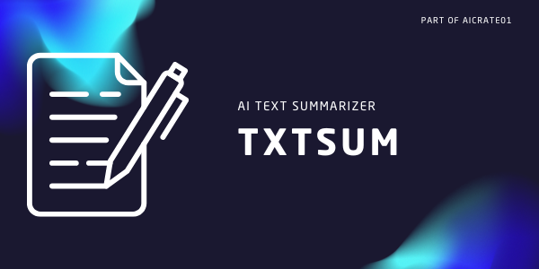

# TXTSUM

TXTSUM is a web application that uses artificial intelligence to generate concise summaries of input text. This project is built with Flask for the backend, and HTML, CSS, and JavaScript for the frontend.

## Features

- Text summarization using the HuggingChat API
- Responsive design with Bootstrap
- Dark mode toggle
- Loading spinner for better user experience

## Technologies Used

- Backend:
  - Python 3.11.7
  - Flask 2.3.3
  - Werkzeug 2.3.7
  - Gunicorn 20.1.0 (for production deployment)
  - Requests 2.26.0 (for API calls)

- Frontend:
  - HTML5
  - CSS3
  - JavaScript
  - Bootstrap 5.3.0-alpha1

## Setup and Installation

1. Clone the repository:
   ```
   git clone https://github.com/hizzybabe/txtsum.git
   cd txtsum
   ```

2. Create a virtual environment and activate it:
   ```
   python -m venv venv
   source venv/bin/activate  # On Windows, use `venv\Scripts\activate`
   ```

3. Install the required packages:
   ```
   pip install -r requirements.txt
   ```

4. Set up your HuggingChat API key:
   - Sign up for a HuggingChat API key at https://huggingface.co/
   - Set the environment variable:
     ```
     export HUGGINGCHAT_API_KEY=your_api_key_here
     ```
     On Windows, use `set` instead of `export`.

5. Run the application:
   ```
   python app.py
   ```

6. Open your web browser and navigate to `http://localhost:5000` to use the application.

## Usage

1. Enter or paste the text you want to summarize in the input textarea.
2. Click the "Summarize" button to generate a summary.
3. The summary will appear in the "Summary" section below.
4. Use the dark mode toggle (🌓) in the top-right corner to switch between light and dark modes.

## Deployment

This application is ready for deployment on Heroku. The `Procfile` and `runtime.txt` files are already set up for this purpose.

To deploy on Heroku:

1. Create a new Heroku app.
2. Set the `HUGGINGCHAT_API_KEY` environment variable in your Heroku app settings.
3. Connect your GitHub repository to the Heroku app.
4. Deploy the application.

## File Structure

- `app.py`: Main Flask application file
- `requirements.txt`: List of Python dependencies
- `Procfile`: Heroku deployment configuration
- `runtime.txt`: Python runtime specification for Heroku
- `templates/index.html`: HTML template for the main page
- `static/css/styles.css`: Custom CSS styles
- `static/js/script.js`: Custom JavaScript for frontend functionality

## Contributing

Contributions are welcome! Please feel free to submit a Pull Request.

## License

This project is open source and available under the [MIT License](LICENSE).
